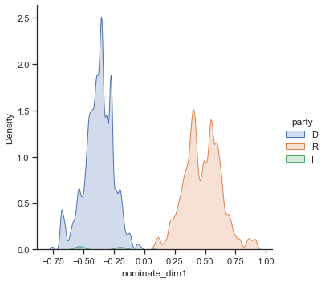
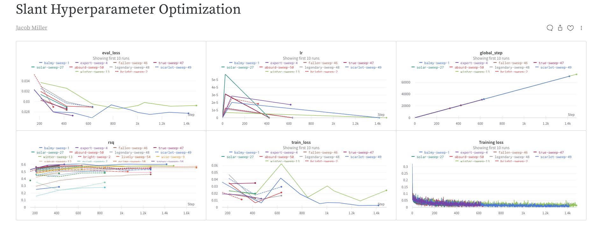
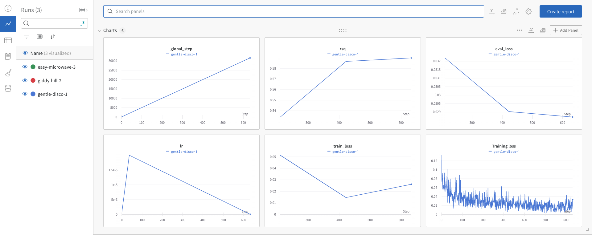
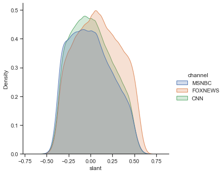

# Quantifiying Media Bias on Cable News: BERT Slant Model

In this python notebook I explore quantifiying media bias as "slant" on U.S. cable news. I use a very large corpus of cable news broadcasts (≈6 million 1-minute broadcasts) web scraped from the [TV Archive][1] and state-of-the-art Transformer models trained to recognize media slant to do this. 

The slant method was pioneered by Gentzkow and Shapiro (2010). The idea is to identify ideological language that politicians use, and then to capture the use of this language in the media. For example (see Djourelova 2021), when discussing the topic of immigration to the U.S. via non-legal routes, conservatives tend to refer to these immigrants as "illegal immigrants", while liberals tend to use the term "undocumented immigrants". Thus if a media outlet always uses the term "illegal immigrant" when discussing this topic, then it is probably a more conservative media outlet. 

I take this slant approach by training/fine-tuning the Transformer model BERT using the ideology of politicians as the target label and the text of their speeches in Congress as the features. I then run this model on my corpus of cable news broadcasts, obtaining its predicted estimates of slant. I did this with the easy to use [Simple Transformers][2] python library. 

Let's get started!

[1]: https://archive.org/details/tv
[2]: https://simpletransformers.ai/


Install and load in necessary packages


```python
#!pip3 install pandas numpy seaborn wandb matplotlib

import pandas as pd
import numpy as np
import matplotlib.pyplot as plt
import seaborn as sns
import wandb
from pprint import pprint 

sns.set_theme(style="ticks")

%matplotlib inline

```

## Congressional Speeches and Ideology Data 

Now we want to load in the data that was used to train the BERT slant model. Because these datasets are very large, they are not available in this repo. If you'd like access to this data, send me an email!

The data consists of speeches given by politicians during the 111th-114th Congresses (2009-2016) paired with information on the politicians' ideology. The speeches come from Gentzkow, Shapiro and Taddy (2019), who collected the data from the Congressional Record. They cleaned and parsed the speeches, making them far easier to work with. The politician ideology estimates come from Voteview.com. They estimate politician ideology based on observed voting behavior in Congress. Intuitively, if two politicians consistently vote similarly to one another, then they will be estimated to have a similar ideology. 


```python
# load in the data
cong_ideology_training = pd.read_csv(
    "raw-data/congressional_speeches_ideology.csv", 
    encoding="ISO-8859-1")
# keep only speeches from the 111th to the 114th congresses (overlaps with sample period)
cong_ideology_training = cong_ideology_training[cong_ideology_training["congress"] >= 111]
# convert text to lower case
cong_ideology_training["speech"] = cong_ideology_training["speech"].apply(lambda x: x.lower())
```

Below we can see that we have a lot of information to go along with the speeches, including who the speaker was, which Congress the speech was given in, what their position in Congress is, their party, etc. At the end we find two estimates of the speaker's ideology, nominate_dim1 and nominate_dim2. We will focus on nominate_dim1, which is thought to correspond to the traditional "left-right" dimension of ideology. 


```python
# get a selection of data for viewing
pprint(cong_ideology_training.sample(n=5, random_state=1))
```

            speakerid   speech_id lastname firstname chamber state gender party  \
    336843  114120961  1140096858     REID     HARRY       S    NV      M     D   
    313296  113122390  1130092588   CRAMER     KEVIN       H    ND      M     R   
    275910  113117441  1130003813    LEVIN      CARL       S    MI      M     D   
    186495  111115930  1110153004     OBEY     DAVID       H    WI      M     D   
    326608  114119510  1140054277  GARRETT     SCOTT       H    NJ      M     R   
    
            district nonvoting                                             speech  \
    336843       NaN    voting  mr. president. it is not necessary to go into ...   
    313296       0.0    voting  mr. speaker. in new town. north dakota. right ...   
    275910       NaN    voting  i thank my good friend from rhode island. who ...   
    186495       7.0    voting  again. as ive said. was my chairman and. as a ...   
    326608       5.0    voting  mr. speaker. i yield myself the balance of my ...   
    
            congress  sentence_count bioguide_id  nominate_dim1  nominate_dim2  
    336843       114             127     R000146         -0.276          0.258  
    313296       113              17     C001096          0.393          0.327  
    275910       113             127     L000261         -0.395         -0.116  
    186495       111              61     O000007         -0.450         -0.063  
    326608       114              12     G000548          0.688         -0.243  


Here we print one of the speeches given by one of the most conservative senators in Congress, Rand Paul: 


```python
pprint("Rand Paul Ideology Score: " + str(cong_ideology_training["nominate_dim1"][264838]))
pprint(cong_ideology_training.speech[264838][0:1000])
```

    'Rand Paul Ideology Score: 0.877'
    ('the question i have for senate is. has your government gotten out of '
     'control? have the regulators become so numerous and so zealous that we cant '
     'even carry on the ordinary affairs of our government? we recently had a '
     'bridge where a boat ran into the bridge in kentucky and one could no longer '
     'cross the bridge because it is not there. we have to wait for environmental '
     'regulations and environmental studies. which sometimes can be 4 and 5 years. '
     'before we can repair our bridges and our roads during an emergency. this is '
     'crazy. this goes on even in regular affairs. such as trying to replace a '
     'sewage plant in our state or throughout the united states. do we want to '
     'live in a country where we have to stop and count how many barnacles are on '
     'our bridge before we decide whether to rebuild the bridge? do we want to '
     'stop and count how many mussels are attached to the pier before we rebuild '
     'the bridge? in the end we are going to rebuild the bridge anyway. but we '
     'spend a years time or more wasted o')


And here is an example of a speech given by a famous liberal senator, Bernie Sanders: 


```python
pprint("Bernie Sanders Ideology Score: " + str(cong_ideology_training["nominate_dim1"][202558]))
pprint(cong_ideology_training["speech"][202558][0:1000])
```

    'Bernie Sanders Ideology Score: -0.531'
    ('mr. president. soon we will be voting on the lilly ledbetter fair pay act. '
     's. 181. the house of representatives has already passed this legislation by '
     'a vote of 247 to 171. passing this bill today will send a clear message that '
     'our country will not tolerate unequal pay for equal work. as astonishing as '
     'it is. in the year 2009. women earn. on average. only 77 cents for every '
     'dollar earned by men in comparable jobs. what a truly unthinkable. and '
     'frankly disgraceful. circumstanceone that we must do everything within our '
     'power to change. today we have the opportunity to take a small but very '
     'significant step in making sure that americans have the legal opportunity to '
     'challenge pay discrimination. lilly ledbetter was a loyal employee at '
     'goodyear tire and rubber company for 19 years. at first. .her salary was in '
     'line with that of her male colleagues. but over time she got smaller raises '
     'creating a significant pay gap. ms. ledbetter was not -aware of this pay '
     'discrimination until she received')


Here we plot the distribution of nominate_dim1 in Congress, underlining the polarization and partisanship in Congress between liberal and conservative ideology. This is the source of variation that the model will attempt to learn to predict, given the words that politicians use in their speeches.


```python
# plot the distribution of ideology in congress
sns.displot(cong_ideology_training, x="nominate_dim1", hue = "party", kind="kde", fill=True)
plt.show()
```


    

    


## Bert Model Fine-Tuning 

Next, I used this data to fine-tune the BERT model to recognize ideological speech. The "features" are the text of the speeches, and the target labels are the ideological scores. Because ideology is a continuous variable, the training task was a regression task (adding a final linear layer to the BERT model). To converge on a final model, I used WandB sweeps to tune the two most important hyperparameters of these models, the learning rate and the number of epochs. Because these models are very costly to train, I do not do this here. You can see the code for this in scripts/3-bertslant-sweep.py. The results from training these models on powerful cloud computing systems with GPUs on the UZH science cloud platform are presented below from WandB:



After many runs of the model, I converged on a learning rate of 2e-05 and 3 epochs of training as the optimal hyperparameters in this setting. I then trained a model with these hyperparameters in scripts/4-train-bertslant-algorithm.py. The results are presented below. As we can see, the model reaches an R-squared of 0.59, meaning that given the text of speeches in the test set, the model can explain 59% of the variation in politician ideology. 



## Running the Fine-tuned Model on the Cable News Corpus

I then ran this model on my dataset of cable news broadcasts (≈6 million 1-minute broadcast segments) to get the predicted ideology scores of the media broadcasts. I load these results in, and merge them to some metadata so we can start to explore slant on the media. 


```python
# load in the cable news slant scores as predicted from the BERT slant model
media_slant_scores = pd.read_csv(
    "output-data/media-slant-scores.csv", 
    usecols = ["id", "slant"]
    )

# the ideology score was normalized to speed up training, now I undo this normalization to restore the original values
media_slant_scores["slant"] = media_slant_scores["slant"]*(0.913 + 0.757) - 0.757
# load in some meta data for the cable news segments
tv_archive_data = pd.read_csv(
    "raw-data/tv-archive-data.csv", 
    usecols = ["id", "date", "channel"]
    )

# resolving some channel name issues
conditions = [
    tv_archive_data["channel"] == "FOXNEWSW",
    tv_archive_data["channel"] == "MSNBCW",
    tv_archive_data["channel"] == "CNNW"
]
choices = ["FOXNEWS", "MSNBC", "CNN"]
tv_archive_data["channel"] = np.select(conditions, choices)

# keep only cable news 
tv_archive_data = tv_archive_data[
    (tv_archive_data["channel"] == "FOXNEWS") | 
    (tv_archive_data["channel"] == "MSNBC") | 
    (tv_archive_data["channel"] == "CNN")
    ]
# merge the meta data in
media_slant = media_slant_scores.merge(tv_archive_data, on="id", how="inner")
```

Here I plot the distribution of estimated slant by channel. As we can see, Fox News is the most right-wing channel, MSNBC is the most left-wing channel, and CNN is slightly more moderate. This means that the model finds the language used on Fox News to be more like the language used by conservative politicians, and the language on MSNBC to be more like the language used by liberal politicians. These results make sense, and are in line with what other papers in the literature have found (see Martin and Yurugoklu 2017 for example).


```python
# plot the distribution of slant by channel
sns.displot(media_slant, x="slant", hue="channel", kind="kde", fill=True)
plt.show()
```


    

    


# References 

Devlin, Jacob, Ming Wei Chang, Kenton Lee, and Kristina Toutavnova. 2018. “BERT: Pre-training of Deep Bidirectional Transformers for Language Understanding.” *arXiv*: 1810.04805.

Djourelova, Milena. 2021. “Media Persuasion through Slanted Language: Evidence from the Coverage of Immigration.” *Working Paper*.

Gentzkow, Matthew, and Jesse M. Shapiro. 2010. “What Drives Media Slant: Evidence from U.S. Daily Newspapers.” *Econometrica*, 78(1): 35-71.

Gentzkow, Matthew, Jesse M. Shapiro, and Matt Taddy. 2019. “Measuring Group Differences in High-Dimensional Choices: Method and Application to Congressional Speech.” *Econometrica*, 87(4): 1307-1340.

Martin, Gregory J., and Ali Yurugoklu. 2017. “Bias in Cable News: Persuasion and Polarization.” *American Economic Review* 107(9): 2565-2599.
